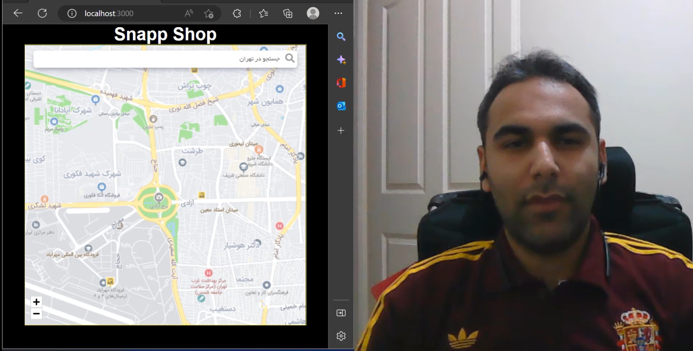

# MAP SURFER
A Simple map surfur project.

# screenshot 

## Technologies

- React
- Next.js
- Typescript
- MSW

## Live Demo
will be added
<!-- You can find the live demo on [Netlify](https://my-virtual-notebook.netlify.app/).  -->

You can also watch the below presentational video. 

## Getting Started

To get a local copy follow these simple example steps.  

1. Open the terminal window and clone the repository using this command:  
`git clone https://github.com/Behnam1369/map-surfer.git` 
2. Change the directory to the map-surfer directory:  
`cd map-surfer`  
3. Install the project's dependencies by running this command:   
`npm install`   
4. Run the application using:  
`npm run dev`  

## Authors

👤 **Behnam Aghaali**

- GitHub: [https://github.com/Behnam1369](https://github.com/Behnam1369)
- LinkedIn: [https://www.linkedin.com/in/behnam-aghaali](https://www.linkedin.com/in/behnam-aghaali)
- Twitter: [https://twitter.com/behnamagh1369](https://twitter.com/behnamagh1369)
- Email: [behnam.aghaali@yahoo.com](mailto:behnam.aghaali@yahoo.com)

## 🤝 Contributing

Contributions, issues, and feature requests are welcome!

Feel free to check the [issues page](../../issues/).

## Show your support

Give a ⭐️ if you like this project!
